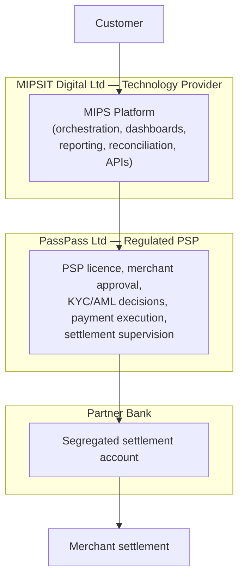
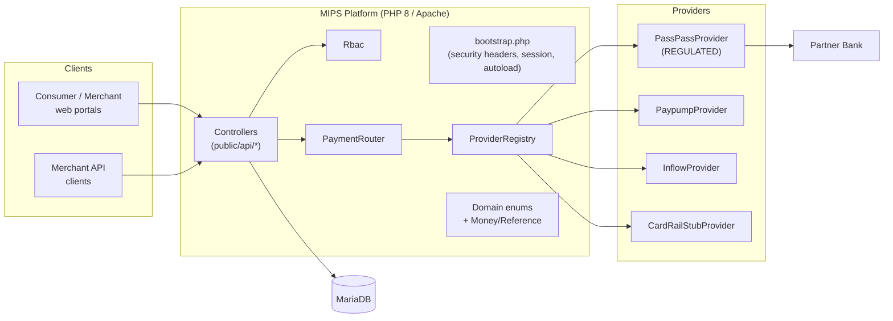
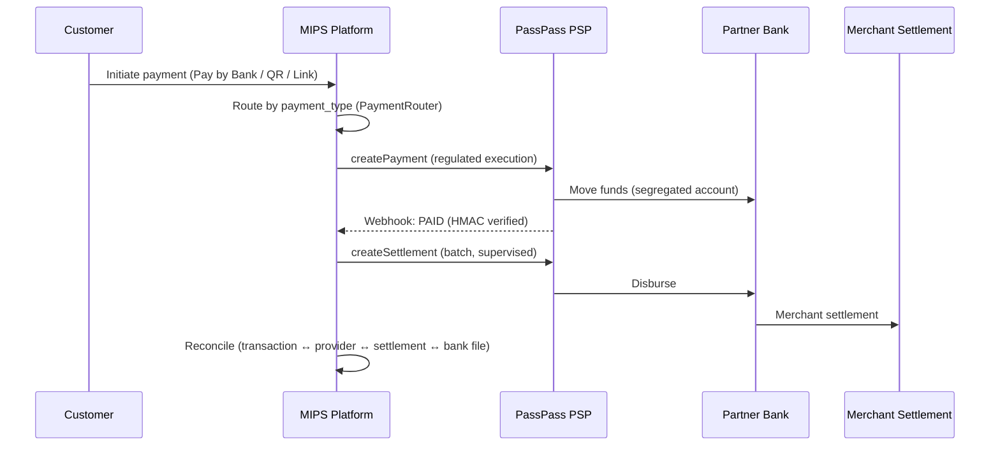
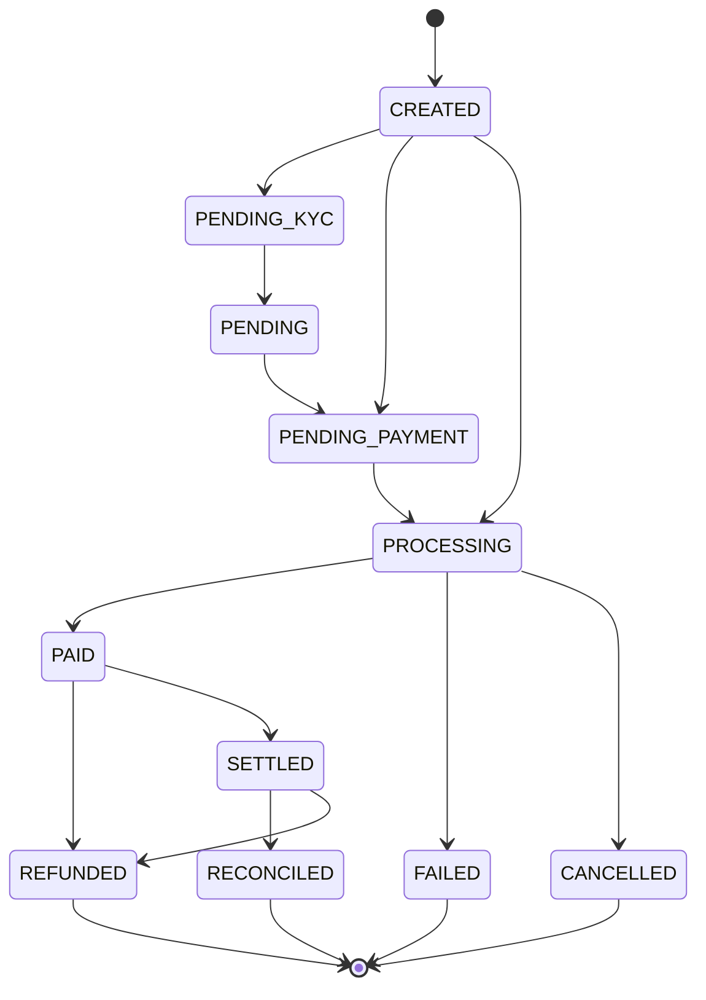
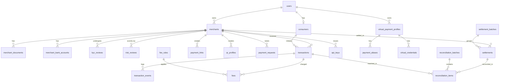

# PassPass Platform — Solution Architecture

> **Regulated entity:** PassPass Ltd (PSP licence holder)
> **Technology provider:** MIPSIT Digital Ltd (orchestration / this platform)
> **Partner Bank:** settlement & banking infrastructure
> **Status:** Sandbox / prototype MVP. Nothing here implies that any entity is
> licensed, approved, or operational unless explicitly configured.

This document is the entry point for the architecture. It opens with the
**architecture review** the brief asked for (risks, regulatory assumptions,
gaps, improvements) and then describes the design that the code in this branch
implements.

---

## 1. Architecture review

### 1.1 What was decided (and why)

The brief proposed a Next.js + Prisma + PostgreSQL + Docker stack. The existing
repository is a lean, security-conscious **PHP 8 + MariaDB** app on Apache
shared hosting, with working auth (PDO prepared statements, CSRF, rate limiting,
hardened sessions, RBAC-lite). After confirming with the product owner, the MVP
**extends the PHP/MariaDB foundation** rather than rewriting it. This:

- preserves a working, audited authentication core;
- matches the likely production hosting (shared/cPanel PHP) for a Mauritian SME;
- keeps the deployment surface small for a sandbox.

The provider/routing abstractions, money handling, RBAC, and state machine are
written so a later move to another runtime would be a port of well-isolated
modules, not a redesign.

### 1.2 Regulatory assumptions (must be validated before go-live)

| # | Assumption | Risk if wrong |
|---|------------|---------------|
| A1 | PassPass Ltd holds (or will hold) a valid PSP licence in Mauritius. | Operating an unlicensed PSP. The platform is sandbox until this is real. |
| A2 | MIPSIT acts only as a **technology provider / payment orchestrator**, never as a PSP. | Mischaracterising MIPSIT as regulated. Enforced in copy, config, and provider design. |
| A3 | Customer funds are held in a **segregated** partner-bank account controlled by PassPass, not commingled with MIPSIT funds. | Safeguarding / client-money breaches. |
| A4 | KYC/AML decisions are made by **PassPass** compliance staff. | Unlicensed entity making regulated decisions. RBAC grants `merchant.approve` / `kyc.decide` to `compliance_officer` only. |
| A5 | Settlement execution is **supervised by PassPass**; MIPSIT performs finance ops (reconciliation, batch prep) under that supervision. | Unsupervised movement of regulated funds. |
| A6 | No card PAN/CVV is processed in the MVP. Card rail is a stub. | PCI DSS scope creep. `CardRailStubProvider` stores nothing. |
| A7 | Data residency / privacy obligations (Mauritius DPA 2017) are met by the chosen hosting. | Data-protection non-compliance. |

### 1.3 Key risks & mitigations

| Risk | Severity | Mitigation in this MVP | Follow-up |
|------|----------|------------------------|-----------|
| Entity misrepresentation (MIPS shown as PSP) | High | `regulated_entity` stamped on transactions/settlements; configurable legal disclaimer; provider design puts regulated verbs only on `PassPassProvider`. | Legal review of all customer-facing copy. |
| Money rounding / float drift | High | All money is integer **minor units** (`App\Support\Money`). | Add per-currency rounding tests. |
| Double charging on retries | Med | `idempotency_key` (unique) on transactions; `PaymentRequest.idempotencyKey`. | Enforce idempotency in the (future) payment service + provider calls. |
| Webhook spoofing | High | HMAC-SHA256 verification in `AbstractProvider::verifySignature`; inbound log in `webhooks`. | Rotate secrets; reject on missing signature in `live`. |
| Invalid state transitions | Med | `TransactionStatus` state machine guards transitions. | Persist events to `transaction_events` in services. |
| Privilege escalation | High | Central `App\Rbac` permission table; deny-by-default. | Add server-side checks on every new endpoint. |
| Secrets in repo | High | Secrets read from ENV; `.env.example` only; `.htaccess` denies dotfiles/SQL/MD. | Use a real secret manager in prod. |
| Reconciliation blind spots | Med | `reconciliation_items.exception_type` taxonomy (missing/duplicate/amount/reference). | Build the matching engine (Phase 7). |

### 1.4 Gaps the MVP deliberately leaves open (next phases)

- HTTP API controllers for the new modules (only auth endpoints exist today).
- Portal UIs (consumer / merchant / admin / compliance / settlement / recon).
- The payment **service layer** that persists transactions and writes
  `transaction_events` (providers + router + schema are ready for it).
- Real provider integrations (all adapters run in sandbox/stub mode).
- Background jobs (settlement batch runner, recon matcher, webhook processor).
- Automated test suite (test *scenarios* are documented in `TEST_SCENARIOS.md`).

### 1.5 Improvements proposed beyond the brief

1. **Integer money everywhere** with a single `Money` helper (brief was silent).
2. **State machine** with explicit allowed transitions, not free-text statuses.
3. **Capability interfaces** (`MerchantProvider`, `SettlementProvider`) so only
   the regulated adapter can expose regulated verbs — the entity split is
   enforced by *types*, not just documentation.
4. **`regulated_transaction_id`** issued per payment for clean PSP reconciliation.
5. **Basis-point fee rules** with min/max caps for predictable pricing.

---

## 2. Entity & responsibility model



The platform must **never** represent MIPS as a licensed PSP. All regulated
activities are performed by PassPass; MIPS is the technology and orchestration
layer.

---

## 3. System architecture



### Backend structure (`/src`)

```
src/
  bootstrap.php            # entry bootstrap (existing)
  Database.php Auth.php Session.php Csrf.php RateLimiter.php Response.php Validator.php
  Rbac.php                 # role -> permission table (NEW)
  Domain/                  # NEW — canonical vocabulary (enums + state machine)
    PaymentType.php TransactionStatus.php KycStatus.php
    ComplianceStatus.php RiskRating.php Role.php
  Support/                 # NEW
    Money.php Reference.php
  Providers/               # NEW — provider abstraction layer
    PaymentProvider.php MerchantProvider.php SettlementProvider.php
    PaymentRequest.php ProviderResult.php AbstractProvider.php
    PassPassProvider.php PaypumpProvider.php InflowProvider.php CardRailStubProvider.php
    ProviderRegistry.php
  Routing/
    PaymentRouter.php       # NEW — configurable routing engine
  Services/                # NEW — persistence + orchestration over providers
    MerchantService.php ComplianceService.php PaymentService.php SettlementService.php
  Support/
    Money.php Reference.php Http.php Audit.php   # Http/Audit NEW
  Controllers/             # auth (existing) + Merchant/Kyc/Compliance/Payment/Settlement (NEW)
```

### Frontend structure (`/public`, `/templates`)

Server-rendered PHP views with progressive-enhancement JS (matching the existing
`login`/`register`/`dashboard` pattern). Planned portal entry points:

```
public/
  index.php login.php register.php dashboard.php   # existing
  merchant/  consumer/  admin/  compliance/  settlement/  reconciliation/   # planned
  api/
    auth/...                                        # existing
    merchants/ kyc/ payments/ links/ qr/ transactions/
    settlements/ reconciliation/ providers/ webhooks/   # planned
templates/                                          # *.view.php per screen
```

---

## 4. Payment products & default flow



Products: **Pay by Bank** (A2A), **Merchant QR** (static/dynamic/request),
**Payment Links**, **Virtual Payment Credential** (alias/routing/QR/future
token — *not* a real card in the MVP), **Merchant API** (REST + webhooks).

---

## 5. Transaction state machine



Enforced by `App\Domain\TransactionStatus::canTransitionTo()`.

---

## 6. Provider architecture & routing

The routing engine (`App\Routing\PaymentRouter`) maps a **payment type** to a
**provider** by configuration (`config['routing']`, later the `payment_routes`
table). Providers implement `PaymentProvider`; only the regulated adapter
(`PassPassProvider`) additionally implements `MerchantProvider` and
`SettlementProvider`.

| Payment type | Default provider | Regulated? |
|--------------|------------------|------------|
| `BANK_TRANSFER`, `QR`, `PAYMENT_LINK`, `VIRTUAL_CREDENTIAL` | `passpass` | ✅ PassPass |
| `PAYPUMP_TRANSFER` | `paypump` | ❌ rail |
| `WORKFLOW` | `inflow` | ❌ orchestration |
| `CARD` | `cardrail` (stub) | ❌ no PCI scope |

Resolution order: explicit rule → priority list → default. Selection fails
loudly if no enabled provider supports the type.

---

## 7. Data model (ERD)



Full DDL: `sql/passpass_schema.sql`. Important cross-entity fields:
`regulated_entity`, `regulated_transaction_id`, `regulated_merchant_id`,
`merchant_reference`, `settlement_account`, `settlement_batch_id`,
`kyc_status`, `compliance_status`, `risk_rating`, `provider_name`,
`provider_reference`, `reconciliation_status`.

---

## 8. Admin dashboard KPIs

Total / Active merchants · Pending KYC · Approved merchants · Total / Successful /
Failed transactions · Total volume · Total settlements · Fees generated ·
Pending reconciliation · Settlement exceptions. (Derivable from
`merchants`, `transactions`, `settlements`, `fees`, `reconciliation_items`.)

---

## 9. Phased delivery plan

| Phase | Scope | Status |
|-------|-------|--------|
| 1 | Architecture & file structure | ✅ |
| 2 | Database & schema (MariaDB) | ✅ |
| 3 | Auth & RBAC | ✅ auth existing · RBAC added |
| 4 | Merchant onboarding & KYC | ✅ service + API + portal (verified e2e) |
| 5 | Payments & routing | ✅ engine + providers + service + API + portal |
| 6 | Settlement engine | ✅ batch settle + state transitions (verified e2e) |
| 7 | Reconciliation engine | ✅ 3-way match + exception taxonomy (verified e2e) |
| 8 | Dashboards | ✅ role-aware portal + KPI dashboard + routing view |
| 9 | Testing | ◑ scenarios documented · slices verified end-to-end |
| 10 | Deployment | ✅ Docker + guides |

### Vertical slice (implemented & verified end-to-end)

The onboarding → KYC → Pay by Bank → settlement path is wired through every
layer (controllers → services → providers → router → DB → state machine →
events) and was exercised against a live MariaDB:

1. **Merchant** creates account (PassPass issues `regulated_merchant_id`) and
   submits KYC → `DRAFT → SUBMITTED`.
2. **Compliance officer** (PassPass) scores risk and approves → `APPROVED` /
   `CLEARED`. Merchants cannot self-approve (RBAC `403`); un-cleared merchants
   cannot be paid (compliance gate `422`).
3. **Consumer** initiates Pay by Bank → routed to `passpass`, fee computed from
   `fee_rules`, transaction `CREATED → PROCESSING`, `regulated_transaction_id`
   issued. Idempotency key dedupes retries.
4. **Finance officer** confirms the provider callback (sandbox simulate) →
   `PAID`, then settles → `SETTLED`, with a settlement batch + net payout.

Endpoints (file-based, under `public/api/`): `merchants/{create,show,pending}`,
`kyc/submit`, `compliance/{decision,score}`, `payments/{create,show,simulate,routing}`,
`settlements/{create,list}`, `reconciliation/{run,list}`, `reports/kpis`. The
role-aware portal lives at `public/portal.php`.

### Reconciliation & KPIs (implemented & verified)

`ReconciliationService` performs 3-way matching (transaction ↔ settlement ↔ bank
file). Without a supplied bank file it reconciles against settlements (happy
path → matched → `SETTLED`→`RECONCILED`); a supplied bank file with discrepancies
yields the exception taxonomy (`MISSING_SETTLEMENT`, `DUPLICATE_SETTLEMENT`,
`AMOUNT_MISMATCH`, `REFERENCE_MISMATCH`), recorded in `reconciliation_items` and
surfaced as `transactions.reconciliation_status`. `ReportService` derives the
admin KPIs (merchants, transactions, volume, settlements, fees, pending
reconciliation, settlement exceptions) live from the operational tables.

See `COMPLIANCE.md`, `API.md`, `INSTALL_DEPLOY.md`, `TEST_SCENARIOS.md`.
